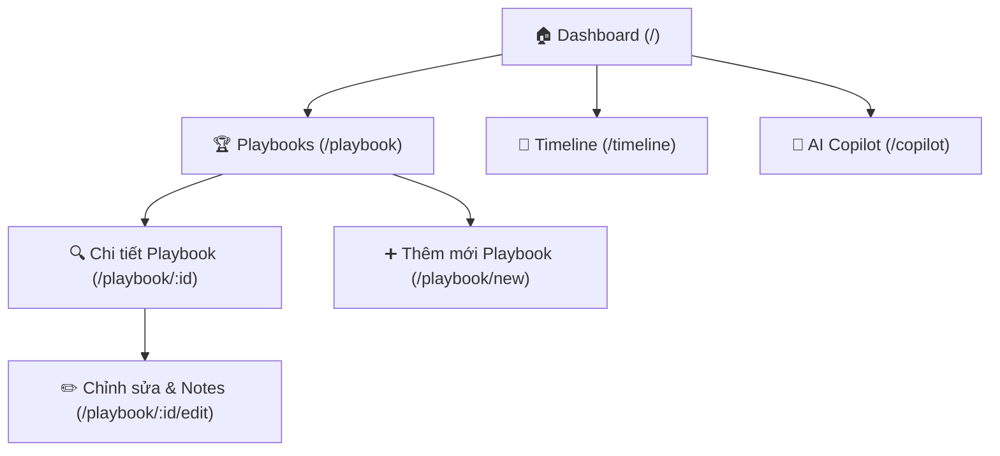

# 🗺️ Conan School Hackathon Workspace Sitemap

Hệ thống sitemap định hướng cấu trúc các trang và luồng luân chuyển thông tin của ứng dụng website quản lý thông tin nội bộ của đội thi tại **VAIC 2026**.

---

## 📐 Kiến trúc Sitemap Tổng quan

---

## 📂 Chi tiết cấu trúc các trang & Chức năng

### 1. 🏠 Dashboard (Trang chủ)

- **Đường dẫn:** `/` hoặc `/dashboard`
- **Chức năng:**
  - Countdown timer đếm ngược 48 giờ.
  - Hiển thị 01 công việc đang làm hiện tại và 01 Checkpoint sắp tới giúp team tập trung tối đa.
  - Cung cấp shortcut truy cập nhanh đến phân tích chiến lược của AI Copilot.

### 2. 🏆 Judges & Mentors Playbook

- **Đường dẫn:** `/playbook`
- **Chức năng:**
  - **Danh sách (`/playbook`):** Hiển thị danh sách giám khảo/mentor phân loại theo 4 nhóm (Domain Expert, Technical Judge, Non-tech Industry Judge, Senior Judge).
  - **Thêm mới (`/playbook/new`):** Giao diện thêm mới và phân loại giám khảo/mentor.
  - **Chi tiết (`/playbook/:id`):** Giao diện hiển thị biểu mẫu Winning Playbook theo đúng template chuẩn (Thông tin cơ bản, Expertise, Evaluation Lens, Câu hỏi thường gặp, Hành động cho team, Cheat Sheet 30s).
  - **Cập nhật (`/playbook/:id/edit`):** Cho phép ghi chú nhanh sau cuộc họp (After Meeting Notes, Insights, thay đổi của Team).

### 3. 📅 Timeline (Lịch trình thực tế)

- **Đường dẫn:** `/timeline`
- **Chức năng:**
  - Hiển thị lịch trình đầy đủ từ ngày 17/07 đến 19/07.
  - Đánh dấu mốc thời gian thực hiện các Checkpoint quan trọng của BTC (màu cam) và nội bộ Team (màu xanh dương).
  - Liệt kê các yêu cầu tài liệu cần nộp ở từng mốc.

### 4. 🧠 AI Copilot (Strategy Copilot)

- **Đường dẫn:** `/copilot`
- **Chức năng:**
  - **Rubric Gap Analyzer:** Nhập/Đánh giá điểm tự đánh giá (self-assessment) của team cho 6 tiêu chí Rubric để xác định tiêu chí yếu nhất.
  - **Mentor Matcher:** Đề xuất tự động mentor phù hợp nhất trong danh sách Playbook dựa trên kỹ năng của họ giúp giải quyết tiêu chí yếu nhất.
  - **Judge Simulator:** Mô phỏng phản biện của các giám khảo đã nhập, đưa ra các câu hỏi khó và khuyến nghị hành động tương ứng để bảo vệ giải pháp.
